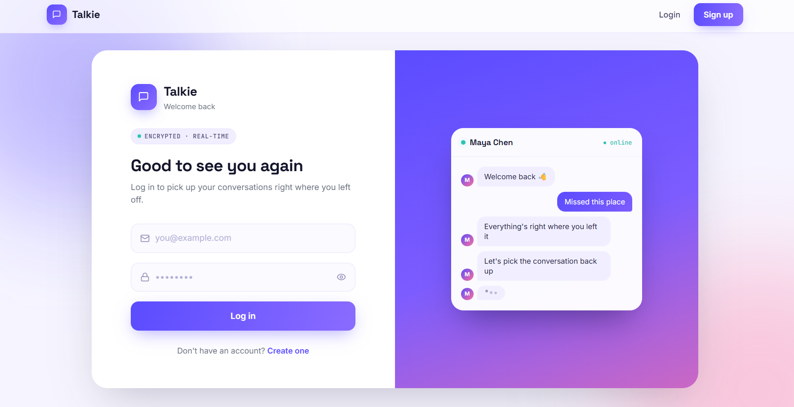
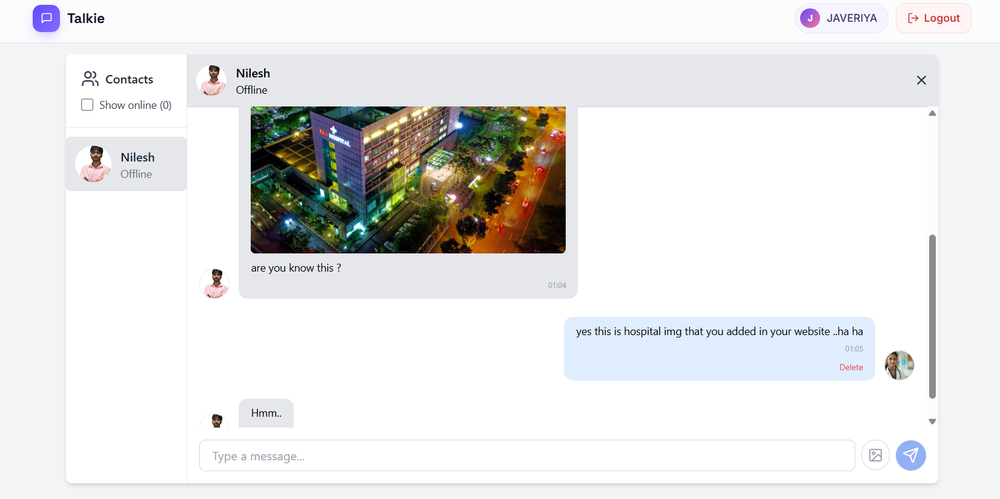

<div align="center">

# 💬 Talkie
### Real-Time MERN Chat Application

A modern real-time chat application built using the MERN Stack with Socket.IO, allowing users to communicate instantly, share images, manage profiles, and see online/offline status.


</div>

---

# ✨ Features

- 🔐 User Authentication
- 💬 Real-Time Messaging using Socket.IO
- 🟢 Online / Offline User Status
- 📷 Image Sharing in Chat
- 👤 Profile Update
- 🖼️ Upload Profile Picture
- 🗑️ Delete Messages
- 📱 Responsive Design
- ⚡ Instant Message Delivery
- 🎨 Clean & Modern UI

---

# 📸 Screenshots

## Login Page



---

## Chat Interface



---

# 🛠 Tech Stack

### Frontend

- React.js
- Vite
- CSS
- Axios
- Socket.IO Client

### Backend

- Node.js
- Express.js
- MongoDB
- Mongoose
- Socket.IO
- JWT Authentication
- Multer

---

# 📂 Project Structure

```
Talkie
│
├── client
│   ├── public
│   ├── src
│   └── package.json
│
├── server
│   ├── config
│   ├── controller
│   ├── database
│   ├── middleware
│   ├── models
│   ├── routes
│   ├── utils
│   └── package.json
│
└── README.md
```

---

# ⚙️ Installation

## Clone Repository

```bash
git clone https://github.com/YOUR_USERNAME/Talkie.git
```

```
cd Talkie
```

---

## Install Client

```bash
cd client
npm install
```

---

## Install Server

```bash
cd ../server
npm install
```

---

## Environment Variables

Create

```
server/config/config.env
```

Example

```env
PORT=5000

MONGO_URI=YOUR_MONGODB_URI

JWT_SECRET=YOUR_SECRET_KEY

CLOUDINARY_CLOUD_NAME=

CLOUDINARY_API_KEY=

CLOUDINARY_API_SECRET=
```

---

## Run Backend

```bash
cd server
npm run server
```

---

## Run Frontend

```bash
cd client
npm run dev
```

---

# 🚀 Future Improvements

- ✅ Voice Messages
- ✅ Video Calling
- ✅ Read Receipts
- ✅ Group Chats
- ✅ Emoji Support
- ✅ Typing Indicator
- ✅ Push Notifications
- ✅ Message Reactions

---

# 📌 Learning Outcomes

During this project I learned:

- Real-time communication using Socket.IO
- JWT Authentication
- REST API Development
- MongoDB Data Modeling
- Image Uploads
- MERN Stack Architecture
- State Management
- Responsive UI Design

---

# 👨‍💻 Author

**Nilesh Kumar**

- GitHub: https://github.com/NILESH2327
- LinkedIn: *(Add your LinkedIn URL)*

---

# ⭐ Support

If you like this project, consider giving it a ⭐ on GitHub.
